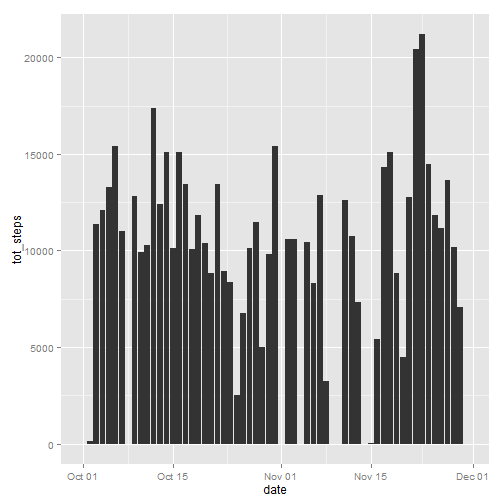
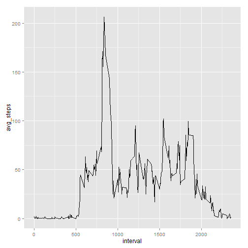
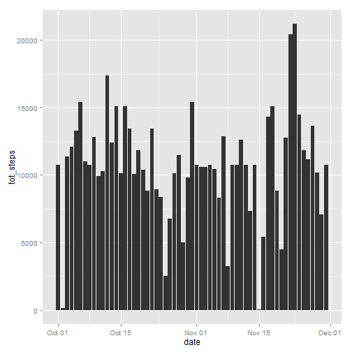
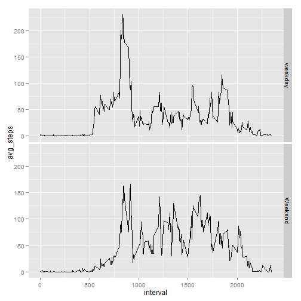

This is an RMarkdown report that answers the questions related to PeerAssesment1 for the course Reproducible Research 

This assignment makes use of data from a personal activity monitoring device. This device collects data at 5 minute intervals through out the day. The data consists of two months of data from an anonymous individual collected during the months of October and November, 2012 and include the number of steps taken in 5 minute intervals each day.


## Loading and preprocessing the data

Loading the required packages


```r
require(dplyr)
require(ggplot2)
require(utils)
require(lubridate)
```


reading data from zip file

```r
unzip("activity.zip")
activity <- tbl_df(read.csv("activity.csv"))
```

inspecting our data


```r
activity
```

```
## Source: local data frame [17,568 x 3]
## 
##    steps       date interval
## 1     NA 2012-10-01        0
## 2     NA 2012-10-01        5
## 3     NA 2012-10-01       10
## 4     NA 2012-10-01       15
## 5     NA 2012-10-01       20
## 6     NA 2012-10-01       25
## 7     NA 2012-10-01       30
## 8     NA 2012-10-01       35
## 9     NA 2012-10-01       40
## 10    NA 2012-10-01       45
## ..   ...        ...      ...
```

```r
glimpse(activity)
```

```
## Variables:
## $ steps    (int) NA, NA, NA, NA, NA, NA, NA, NA, NA, NA, NA, NA, NA, N...
## $ date     (fctr) 2012-10-01, 2012-10-01, 2012-10-01, 2012-10-01, 2012...
## $ interval (int) 0, 5, 10, 15, 20, 25, 30, 35, 40, 45, 50, 55, 100, 10...
```

Changing the format of the date variable and showing a summary

```r
activity$date<-ymd(activity$date)
summary(activity)
```

```
##      steps             date               interval     
##  Min.   :  0.00   Min.   :2012-10-01   Min.   :   0.0  
##  1st Qu.:  0.00   1st Qu.:2012-10-16   1st Qu.: 588.8  
##  Median :  0.00   Median :2012-10-31   Median :1177.5  
##  Mean   : 37.38   Mean   :2012-10-31   Mean   :1177.5  
##  3rd Qu.: 12.00   3rd Qu.:2012-11-15   3rd Qu.:1766.2  
##  Max.   :806.00   Max.   :2012-11-30   Max.   :2355.0  
##  NA's   :2304
```


## What is mean total number of steps taken per day?

1. Make a histogram of the total number of steps taken each day

```r
tot_steps <- activity %>% group_by(date) %>% summarize(tot_steps = sum(steps, na.rm = TRUE))
a<- ggplot(data = tot_steps, aes(x= date, y = tot_steps))
a+geom_histogram(stat = "identity")
```

 

2. Calculate and report the mean and median total number of steps taken per day


```r
activity %>% group_by(date) %>% summarize(mean_step =mean(steps, na.rm = TRUE), median_step = median (steps, na.rm = TRUE))
```

```
## Source: local data frame [61 x 3]
## 
##          date  mean_step median_step
## 1  2012-10-01        NaN          NA
## 2  2012-10-02  0.4375000           0
## 3  2012-10-03 39.4166667           0
## 4  2012-10-04 42.0694444           0
## 5  2012-10-05 46.1597222           0
## 6  2012-10-06 53.5416667           0
## 7  2012-10-07 38.2465278           0
## 8  2012-10-08        NaN          NA
## 9  2012-10-09 44.4826389           0
## 10 2012-10-10 34.3750000           0
## 11 2012-10-11 35.7777778           0
## 12 2012-10-12 60.3541667           0
## 13 2012-10-13 43.1458333           0
## 14 2012-10-14 52.4236111           0
## 15 2012-10-15 35.2048611           0
## 16 2012-10-16 52.3750000           0
## 17 2012-10-17 46.7083333           0
## 18 2012-10-18 34.9166667           0
## 19 2012-10-19 41.0729167           0
## 20 2012-10-20 36.0937500           0
## 21 2012-10-21 30.6284722           0
## 22 2012-10-22 46.7361111           0
## 23 2012-10-23 30.9652778           0
## 24 2012-10-24 29.0104167           0
## 25 2012-10-25  8.6527778           0
## 26 2012-10-26 23.5347222           0
## 27 2012-10-27 35.1354167           0
## 28 2012-10-28 39.7847222           0
## 29 2012-10-29 17.4236111           0
## 30 2012-10-30 34.0937500           0
## 31 2012-10-31 53.5208333           0
## 32 2012-11-01        NaN          NA
## 33 2012-11-02 36.8055556           0
## 34 2012-11-03 36.7048611           0
## 35 2012-11-04        NaN          NA
## 36 2012-11-05 36.2465278           0
## 37 2012-11-06 28.9375000           0
## 38 2012-11-07 44.7326389           0
## 39 2012-11-08 11.1770833           0
## 40 2012-11-09        NaN          NA
## 41 2012-11-10        NaN          NA
## 42 2012-11-11 43.7777778           0
## 43 2012-11-12 37.3784722           0
## 44 2012-11-13 25.4722222           0
## 45 2012-11-14        NaN          NA
## 46 2012-11-15  0.1423611           0
## 47 2012-11-16 18.8923611           0
## 48 2012-11-17 49.7881944           0
## 49 2012-11-18 52.4652778           0
## 50 2012-11-19 30.6979167           0
## 51 2012-11-20 15.5277778           0
## 52 2012-11-21 44.3993056           0
## 53 2012-11-22 70.9270833           0
## 54 2012-11-23 73.5902778           0
## 55 2012-11-24 50.2708333           0
## 56 2012-11-25 41.0902778           0
## 57 2012-11-26 38.7569444           0
## 58 2012-11-27 47.3819444           0
## 59 2012-11-28 35.3576389           0
## 60 2012-11-29 24.4687500           0
## 61 2012-11-30        NaN          NA
```


## What is the average daily activity pattern?
1. Make a time series plot (i.e. type = "l") of the 5-minute interval (x-axis)
and the average number of steps taken, averaged across all days (y-axis)


```r
by_interval <- activity %>% group_by(interval)%>% summarize(avg_steps = mean(steps, na.rm = TRUE))
ts<- ggplot(data = by_interval, aes(x= interval, y= avg_steps))
ts + geom_line()
```

 

2. Which 5-minute interval, on average across all the days in the dataset,
contains the maximum number of steps?


```r
by_interval%>% filter(avg_steps == max(avg_steps))
```

```
## Source: local data frame [1 x 2]
## 
##   interval avg_steps
## 1      835  206.1698
```


## Imputing missing values

1. Calculate and report the total number of missing values in the dataset
(i.e. the total number of rows with NAs)

```r
sum(!complete.cases(activity))
```

```
## [1] 2304
```
2. Devise a strategy for filling in all of the missing values in the dataset. The
strategy does not need to be sophisticated. For example, you could use
the mean/median for that day, or the mean for that 5-minute interval, etc.
3. Create a new dataset that is equal to the original dataset but with the
missing data filled in.


```r
activity2<-inner_join(activity,by_interval, by = "interval")
activity2<- transform(activity2, steps = ifelse(!is.na(steps), steps, by_interval$avg_steps))
```

4. Make a histogram of the total number of steps taken each day and Calculate
and report the mean and median total number of steps taken per day. Do
these values differ from the estimates from the first part of the assignment?
What is the impact of imputing missing data on the estimates of the total
daily number of steps?

```r
tot_steps2 <- activity2 %>% group_by(date) %>% summarize(tot_steps = sum(steps, na.rm = TRUE))
a<- ggplot(data = tot_steps2, aes(x= date, y = tot_steps))
a+geom_histogram(stat = "identity")
```

 

```r
activity2 %>% group_by(date) %>% summarize(mean_step =mean(steps, na.rm = TRUE), median_step = median (steps, na.rm = TRUE))
```

```
## Source: local data frame [61 x 3]
## 
##          date  mean_step median_step
## 1  2012-10-01 37.3825996    34.11321
## 2  2012-10-02  0.4375000     0.00000
## 3  2012-10-03 39.4166667     0.00000
## 4  2012-10-04 42.0694444     0.00000
## 5  2012-10-05 46.1597222     0.00000
## 6  2012-10-06 53.5416667     0.00000
## 7  2012-10-07 38.2465278     0.00000
## 8  2012-10-08 37.3825996    34.11321
## 9  2012-10-09 44.4826389     0.00000
## 10 2012-10-10 34.3750000     0.00000
## 11 2012-10-11 35.7777778     0.00000
## 12 2012-10-12 60.3541667     0.00000
## 13 2012-10-13 43.1458333     0.00000
## 14 2012-10-14 52.4236111     0.00000
## 15 2012-10-15 35.2048611     0.00000
## 16 2012-10-16 52.3750000     0.00000
## 17 2012-10-17 46.7083333     0.00000
## 18 2012-10-18 34.9166667     0.00000
## 19 2012-10-19 41.0729167     0.00000
## 20 2012-10-20 36.0937500     0.00000
## 21 2012-10-21 30.6284722     0.00000
## 22 2012-10-22 46.7361111     0.00000
## 23 2012-10-23 30.9652778     0.00000
## 24 2012-10-24 29.0104167     0.00000
## 25 2012-10-25  8.6527778     0.00000
## 26 2012-10-26 23.5347222     0.00000
## 27 2012-10-27 35.1354167     0.00000
## 28 2012-10-28 39.7847222     0.00000
## 29 2012-10-29 17.4236111     0.00000
## 30 2012-10-30 34.0937500     0.00000
## 31 2012-10-31 53.5208333     0.00000
## 32 2012-11-01 37.3825996    34.11321
## 33 2012-11-02 36.8055556     0.00000
## 34 2012-11-03 36.7048611     0.00000
## 35 2012-11-04 37.3825996    34.11321
## 36 2012-11-05 36.2465278     0.00000
## 37 2012-11-06 28.9375000     0.00000
## 38 2012-11-07 44.7326389     0.00000
## 39 2012-11-08 11.1770833     0.00000
## 40 2012-11-09 37.3825996    34.11321
## 41 2012-11-10 37.3825996    34.11321
## 42 2012-11-11 43.7777778     0.00000
## 43 2012-11-12 37.3784722     0.00000
## 44 2012-11-13 25.4722222     0.00000
## 45 2012-11-14 37.3825996    34.11321
## 46 2012-11-15  0.1423611     0.00000
## 47 2012-11-16 18.8923611     0.00000
## 48 2012-11-17 49.7881944     0.00000
## 49 2012-11-18 52.4652778     0.00000
## 50 2012-11-19 30.6979167     0.00000
## 51 2012-11-20 15.5277778     0.00000
## 52 2012-11-21 44.3993056     0.00000
## 53 2012-11-22 70.9270833     0.00000
## 54 2012-11-23 73.5902778     0.00000
## 55 2012-11-24 50.2708333     0.00000
## 56 2012-11-25 41.0902778     0.00000
## 57 2012-11-26 38.7569444     0.00000
## 58 2012-11-27 47.3819444     0.00000
## 59 2012-11-28 35.3576389     0.00000
## 60 2012-11-29 24.4687500     0.00000
## 61 2012-11-30 37.3825996    34.11321
```

Yes, the mean and median steps taken per day after imputing missing data is different from the those calculated on the first part of the assignment for the days where the missing data where present

Imputing missing data with the avg daily steps change slightly the distribution


## Are there differences in activity patterns between weekdays and weekends?

For this part the weekdays() function may be of some help here. Use the dataset
with the filled-in missing values for this part.
1. Create a new factor variable in the dataset with two levels - "weekday"
and "weekend" indicating whether a given date is a weekday or weekend
day.


```r
activity2<-tbl_df(activity2%>%mutate(flag = ifelse(weekdays(date)%in% c("Saturday","Sunday"),"Weekend","weekday")))
activity2<- transform(activity2, steps = ifelse(!is.na(steps), steps, by_interval$avg_steps))
```
2. Make a panel plot containing a time series plot (i.e. type = "l") of the
5-minute interval (x-axis) and the average number of steps taken, averaged
across all weekday days or weekend days (y-axis). 


```r
by_interval2 <- activity2%>% group_by(interval, flag)%>% summarize(avg_steps = mean(steps, na.rm = TRUE))
ts<- ggplot(data = by_interval2, aes(x= interval, y= avg_steps))
ts + geom_line() + facet_grid(flag~.)
```

 
